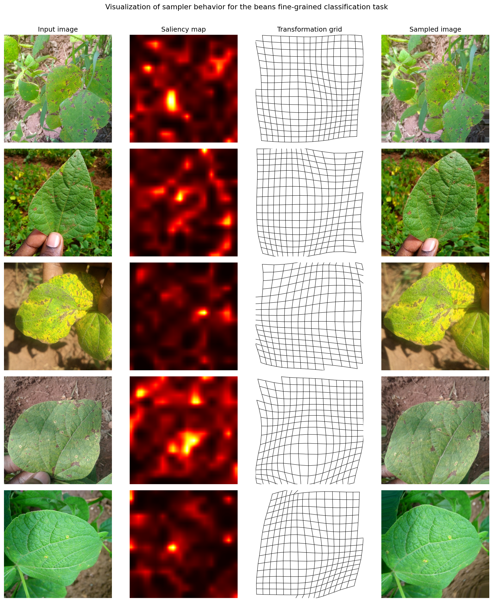

# Knowledge Distillation + Saliency Sampling for Beans Leaf-Disease Classification

Distilling a Vision Transformer teacher (`merve/beans-vit-224`, 85.8 M params)
into a MobileNetV2 student (2.23 M params) on the Hugging Face
[`beans`](https://huggingface.co/datasets/AI-Lab-Makerere/beans) dataset
(1,295 images, 3 classes: `angular_leaf_spot`, `bean_rust`, `healthy`).

A non-uniform [Saliency Sampler](https://arxiv.org/abs/1809.03355)
(Recasens *et al.*, ECCV 2018) is added in front of the student to preserve
the small lesion-level cues that uniform 500 -> 224 down-sampling discards.

## Headline test-set results (N = 128)

| Model                                 | Sampler | Distill | Params         | Test acc | Macro-F1 |
| ------------------------------------- | :-----: | :-----: | -------------- | :------: | :------: |
| MobileNetV2 (ours, ImageNet-init)     |         | yes     | 2.23 M         | 0.9219   | 0.9224   |
| MobileNetV2 + sampler (ours)          | yes     |         | 2.23 + 0.19 M  | 0.8984   | 0.8984   |
| **MobileNetV2 + sampler (ours)**      | yes     | yes     | 2.23 + 0.19 M  | **0.9766** | **0.9767** |
| ViT-B/16 teacher                      | -       | -       | 85.8 M         | 0.9375   | 0.9379   |

The distilled student with the saliency sampler exceeds the teacher by
+0.039 test accuracy with about 2.8 % of its parameters. Full write-up:
[`paper/main.tex`](paper/main.tex).



## Repo layout

```
.
├── .gitignore
├── Figures/              paper figures shipped with the report
├── results/              per-run train/val/test acc + macro-F1 (md + json)
├── scripts/
│   ├── README.md         script documentation + common invocations
│   ├── training/         torchrun entry points
│   │   ├── main.py                 distillation, ViT -> MobileNetV2
│   │   ├── train_baseline.py       MobileNetV2, no teacher
│   │   └── main_with_sampler.py    distillation + Recasens saliency sampler
│   ├── saliency/         SaliencySampler module + truncated MobileNetV3-Small
│   ├── evaluation/       checkpoint 
│   ├── sweeps/           hyperparameter orchestration
│   └── figures/          plot generators
├── requirements.txt
├── LICENSE               MIT
└── README.md
```

## Setup

```bash
conda create -n beans-kd python=3.11 -y
conda activate beans-kd
pip install -r requirements.txt
```

The default 2-GPU setup is `torchrun --nproc_per_node=2`. On dual NVIDIA
cards without NVLink, prefix launches with `NCCL_P2P_DISABLE=1
NCCL_IB_DISABLE=1` to avoid NCCL P2P errors.

## Reproducing the paper's tables

All commands assume the project root as the working directory.

### Table 1 -- temperature sweep

```bash
python scripts/sweeps/sweep_temperature.py \
    --sweep_dir sweep_T --temperatures 1 2 3 4 5 --per_device_batch 32
# writes results/temperature_sweep.{md,json} + Figures/temperature_sweep.png
```

### Table 2 -- random-init student, test set, with vs without distillation

```bash
# no distillation (baseline)
NCCL_P2P_DISABLE=1 NCCL_IB_DISABLE=1 torchrun --standalone --nproc_per_node=2 \
    scripts/training/train_baseline.py --output_dir baseline
python scripts/evaluation/compute_results.py \
    --run_dir baseline --out results/results_baseline.md

# distillation, T = 1 (sweep winner)
NCCL_P2P_DISABLE=1 NCCL_IB_DISABLE=1 torchrun --standalone --nproc_per_node=2 \
    scripts/training/main.py --temperature 1 --output_dir my-awesome-model
python scripts/evaluation/compute_results.py \
    --run_dir my-awesome-model --temperature 1 --out results/results.md
```

### Table 3 -- ImageNet-init student ablation

```bash


# Headline imagenet-init runs (no distill / distill at T=1)
NCCL_P2P_DISABLE=1 NCCL_IB_DISABLE=1 torchrun --standalone --nproc_per_node=2 \
    scripts/training/train_baseline.py --output_dir baseline-imagenet \
    --student_pretrained google/mobilenet_v2_1.0_224
python scripts/evaluation/compute_results.py \
    --run_dir baseline-imagenet --out results/results_baseline-imagenet.md

NCCL_P2P_DISABLE=1 NCCL_IB_DISABLE=1 torchrun --standalone --nproc_per_node=2 \
    scripts/training/main.py --temperature 1 \
    --student_pretrained google/mobilenet_v2_1.0_224 \
    --output_dir mobilenetv2-imagenet-distill
python scripts/evaluation/compute_results.py \
    --run_dir mobilenetv2-imagenet-distill --temperature 1 \
    --out results/results_mobilenetv2-imagenet-distill.md
```

### Table 4 -- saliency sampler results

```bash
# Distillation + sampler, paper-exact SGD, scale = 3
NCCL_P2P_DISABLE=1 NCCL_IB_DISABLE=1 torchrun --standalone --nproc_per_node=2 \
    scripts/training/main_with_sampler.py \
    --temperature 1 --saliency_scale 3 \
    --output_dir my-awesome-model-sampler-sgd-s3
python scripts/evaluation/eval_sampler.py \
    --run_dir my-awesome-model-sampler-sgd-s3 \
    --saliency_scale 3 --temperature 1 \
    --out results/results_sampler_sgd_s3.md

# Sampler without distillation (control: lambda = 0 drops the soft-target term)
NCCL_P2P_DISABLE=1 NCCL_IB_DISABLE=1 torchrun --standalone --nproc_per_node=2 \
    scripts/training/main_with_sampler.py \
    --lambda_param 0.0 --saliency_scale 3 \
    --output_dir my-awesome-model-sampler-sgd-s3-noKD
python scripts/evaluation/eval_sampler.py \
    --run_dir my-awesome-model-sampler-sgd-s3-noKD \
    --saliency_scale 3 --lambda_param 0.0 \
    --out results/results_sampler_sgd_s3_noKD.md
```

### Paper figures

```bash
# Class distribution, per-class samples, loss curves
python scripts/figures/make_figures.py \
    --trainer_state my-awesome-model/checkpoint-510/trainer_state.json

# Paper Fig. 1 (sampler qualitative)
CUDA_VISIBLE_DEVICES="" python scripts/figures/sampler_final.py \
    --checkpoint my-awesome-model-sampler-sgd-s3/checkpoint-660 \
    --indices 21,27,36,52,74 --saliency_scale 3 \
    --out Figures/sampler_final.png

# Softmax-output behaviour of the per-T best students (deployment T = 1)
CUDA_VISIBLE_DEVICES=0 python scripts/figures/logits_distribution.py \
    --sweep_dir sweep_T_imagenet --split test \
    --out Figures/logits_distribution_imagenet.png
# Or, on the random-init batch-32 sweep that backs Table 1:
CUDA_VISIBLE_DEVICES=0 python scripts/figures/logits_distribution.py \
    --run_dirs sweep_T/T1_b32 sweep_T/T2_b32 sweep_T/T3_b32 sweep_T/T4_b32 my-awesome-model \
    --temperatures 1 2 3 4 5 --split test \
    --out Figures/logits_distribution_randominit.png
```


## References

- Hinton, Vinyals, Dean. *Distilling the Knowledge in a Neural Network.* arXiv:1503.02531, 2015.
- Sandler *et al.* *MobileNetV2: Inverted Residuals and Linear Bottlenecks.* CVPR 2018.
- Recasens *et al.* *Learning to Zoom: A Saliency-Based Sampling Layer for Neural Networks.* ECCV 2018.
- Dosovitskiy *et al.* *An Image Is Worth 16x16 Words.* ICLR 2021.
- Elfatimi, Eryigit, Elfatimi. *Beans Leaf Diseases Classification Using MobileNet Models.* IEEE Access, 2022.
- Abed *et al.* *A Modern Deep Learning Framework in Robot Vision for Automated Bean Leaves Diseases Detection.* Int. J. Intell. Robot. Appl., 2021.

Full BibTeX in [`paper/references.bib`](paper/references.bib).

## License

MIT -- see [`LICENSE`](LICENSE).
